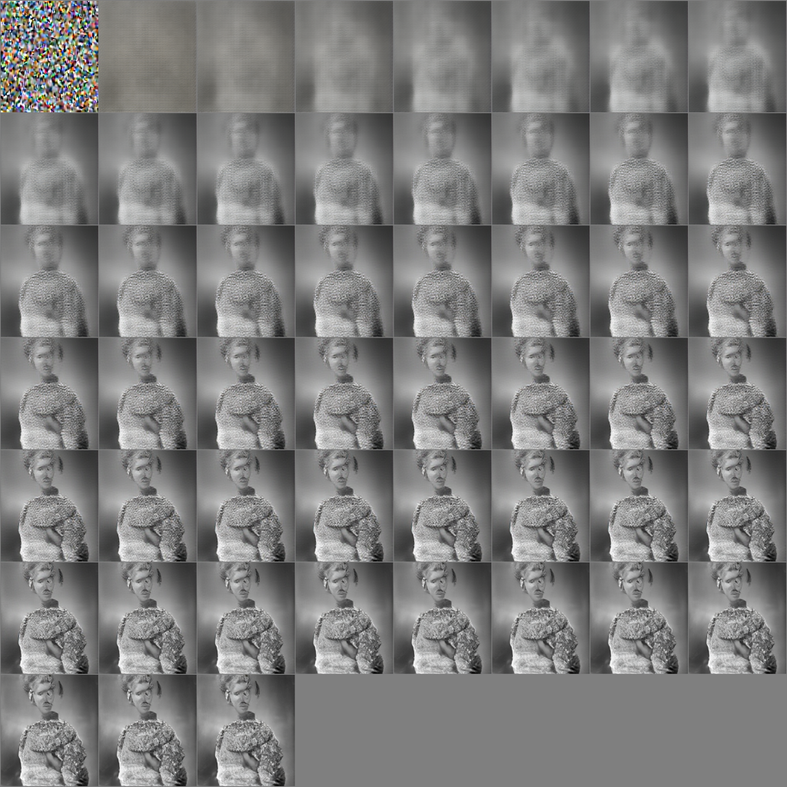
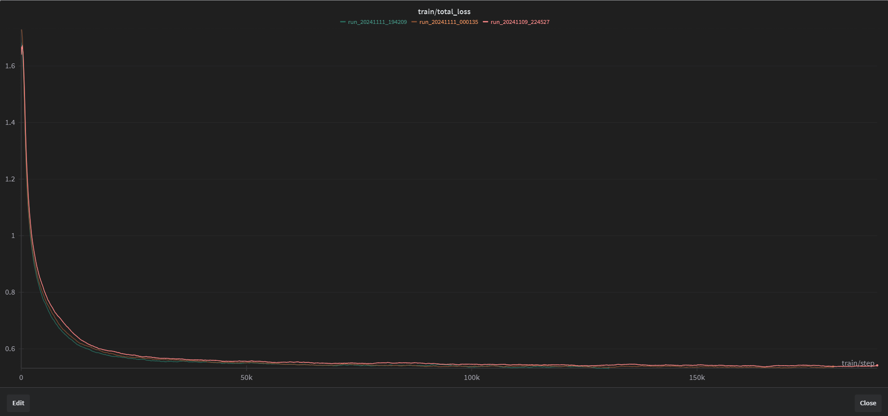

# Tiny Rectified Flow Diffusion 


This repository contains essential scripts and commands for training a diffusion model using the PD3M dataset. Below, you'll find step-by-step instructions for setting up, preparing your data, and training your model, along with some useful optimization tips.

For the text encoder i use the [t5-base](https://huggingface.co/EleutherAI/pile-t5-base) encoder model

I trained the model on a local RTX3090GPU along 12hours, tune the model parameters according to your GPU memory and compute capabilities.

The model of the image was trained with:
- Depth: 16
- Width: 768
- Num heads: 12
- compile: True
- Num images: 1.2M
- LR: 1e-4
- Text encoder sie: 1024

# Data
I used the PD3M dataset, you can download the dataset from [here](https://huggingface.co/datasets/Spawning/PD3M).

# Logging

I used wandb to log the training process. Its a very useful tool to monitor the training process and to compare the training of different models.


# Step by step guide

## 1. Install requirements

Create a virtual environment and install the requirements:
```bash
python3.11 -vm venv .venv
source .venv/bin/activate
pip install -r requirements.txt
```
I tested on python 3.11 and python 3.12 and it works well, maybe you will need to install ```python-dev``` packages 
in order to use ```torch.compile```.

## 2. Download the dataset

Run the following command to download PD3M files. Each file contains 100,000 rows, and you can specify the number of files you want to download:
```bash
python3 -m data.main --local_dir ./data --num_files_to_download 2
```

- Local Directory: ./data
- Number of Files: Adjust the --num_files_to_download parameter as needed.

After downloading, you can count the number of ```images``` in your images folder:
```bash
find . -type f -iname "*.jpg" | grep -c ".jpg"
```


## 3. Preprocess the dataset

Before training, run the file preprocessor script to prepare the images:
```bash
python3 -m data.prepare_data --path_image_dataset ./data/images --path_output_dataset ./data/dataset
```

- Path to Image Dataset: ```./data/images```
- Output Dataset Path: ```./data/dataset```

## 4. Train the model
To start training your diffusion model, use:
```bash
python3 -m model.dit_trainer
```
This script initializes the model training loop. You can tune the training parameters in the ```trainer.py``` script.

# Inference

You can find the inference script sample in the ```model/infer_mmdit.ipynb``` file.

# Acknowledgments

- PD3M Dataset - https://huggingface.co/datasets/Spawning/PD3M
- Text Encoder - https://huggingface.co/EleutherAI/pile-t5-base
- REPA-RF - https://github.com/cloneofsimo/repa-rf


Happy Diffusing! 🚀